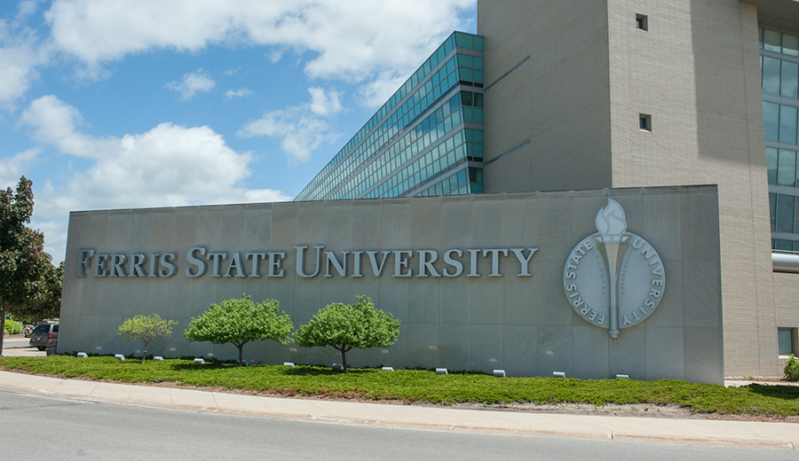
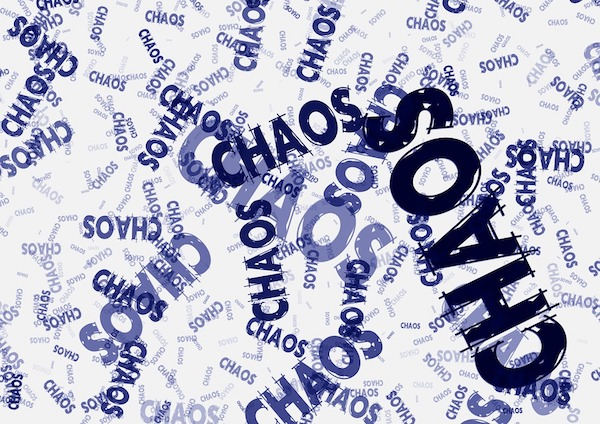

```{r setup, include=FALSE}
knitr::opts_chunk$set(echo = FALSE, fig.align = "center")
```
## About Ferris State
<div id="left">
* West central Michigan
* Medium Masters university
* 13,800 students
* Used TracDat/Improve since 2008
* Locally hosted, so no Analytics

</div>
<div id="right">
<section class = "plain">
 
</section>

## The Killer P's
<section class = "plain">
 
</section>

## Philosophy of Assessment
1. Begin with your questions
1. Only assess things that you are willing to change
1. Make it reproducible
	* **Measure** _reliably_
	* **Analyze** _transparently_
	* **Report** _publicly_
	* **Discuss** _objectively_
	* **Respond** _intentionally_

## Assessment Goals
* **Assumptions:**

	1. The program consists of courses
	1. Student preformance in course work is the most valid measure
	1. General Education applies to all students

* **Therefore, we are measuring student performance across all courses in the program**

## Project Scope
* Each semester we offer...

	* About 300 different course codes that...
	* Are taken by over 5,000 students and are...
	* Taught by over 300 faculty and...
	* Generate over 50,000 SCH and...
	* $20,000,000 in revenue

## Distributed Assessment
<section class = "plain">

</section>

## Implementation Drivers
* The three keys to our program assessment strategy:

* **Simplify** — reduce complexity  

* **Standardize** — reduce variance

* **Automate** — reduce workload

## Core Competencies  
Simplify to eight student competencies:

<div id="left">
* Collaboration
* Communication
* Culture
* Diversity
</div>
<div id="right">
* Natural Sciences
* Problem Solving
* Quantitative Literacy
* Self and Society
</div>

## Improve Implementation
* Each competency is a Reporting Unit
* Each competency has four FLOs
* One outcome measured each semester
* Rolling two-year program cycle

## Standard Measures
* 14 different measures are defined
* Each measure has its own:
	* Scoring system (zero to four point scale)
	* Analysis interpretation (four threshold values)
	* Criterion leveling (expectations by course level)

https://ferris.edu/HTMLS/academics/general-education/evidence/measures.htm


## Course Registration

* Who is collecting data?
* What competency is being measured?
* What measure is being used?
* All tracked using a Google form

http://bit.ly/2LDDeKx

## Tracking Registrations

* Need up-to-the-minute status
* Live report generated with R
* Google API access to current data
* Permanent reports generated

http://www.reproducibleassessment.com/1702/

## Creating Assignments

* All assignments are created by me
* Faculty are _easily_ frustrated
	* Need uniformity
	* Yet, need flexibility
* TextExpander

https://www.cliftonfranklund.com/textexpander.html

## Assignment Benefits

* No log-in required
* Received as an email
* Simple to complete
* Attach a data form and submit

## Tracking Assignments

* Administrators want to know the status
* _Ad hoc_ reports for rapid overviews  

	* Assignments
	* Summary results
	* Aggregate reports

## Semi-Annual Reporting

* Using RMarkdown
* Reuseable code
* PDF reports for printing
* HTML reports for distribution and collaboration


## Questions?

* All of these resources are linked to from your handout
* Licensed using either CC-BY 4.0 or MIT
* Feel free to contact me if you have questions or comments

<section class = "plain">
 
</section>
