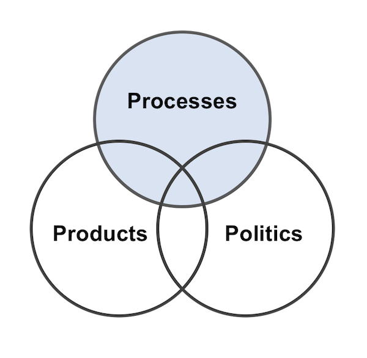

```{r setup, include=FALSE}
knitr::opts_chunk$set(echo = FALSE, fig.align = "center")
```
## About Ferris State
<div id="left">
* West Central Michigan
* Medium Masters University
* 14,600 students
* Recently Revised General Education
* Used Improve Since 2008

</div>
<div id="right">
<section class = "plain">
 
</section>

## The Killer P's of Assessment
<section class = "plain">
 
</section>

## General Education Goals
* Track and improve program effectiveness
* **Assumptions:**
	1. The program consists of courses
	1. Student preformance in course work is the most valid measure
	1. General Education applies to all students
* **Therefore, we are measuring student performance across all courses in the program**

## Project Scope
* In a semester...

>* Over 300 different course codes
>* Touching over 5,000 students
>* Involving over 300 faculty
>* Generating over 50,000 SCH

## Project Resources
>* Program coordinator (me, 50% release)
>* General Education Committee (advisory)
>* Budget ($0)
>* Staff (none)
>* TracDat

## The Assessment Cycle
<section class = "plain">

</section>

## The Futile Cycle
<section class = "plain">

</section>

## A Better Model
<blockquote>"Assessment is not a spreadsheet -- it is a conversation"<br />Irmeli Halinen</blockquote>
<section class = "plain">

</section>

## Sustainable assessment
* The three keys to our program assessment strategy:

>- **Simplify** — reduce complexity  
>- **Standardize** — reduce variance
>- **Automate** — reduce workload

>- Aiming for reproducible processes to increase transparency and encourage engagement

## Simplify: Core Competencies  
* Eight competencies: 

>* Collaboration, Communication, Culture, Diversity, Natural Sciences, Problem Solving, Quantitative Literacy, Self and Society
>* Overseen by a faculty subcommittees
>* Operational definitions and relevance statements
>* Entered into TracDat as Assessment Units

## Simplify: Ferris Learning Outcomes
>* Each competency has four learning outcomes
>* Based upon what we want our graduating seniors to look like
>* One outcome measured each semester
>* Rolling two-year program cycle
>* Outcomes are mapped to other strategic activities in TracDat

## Standardize: Measures
* Created in order to get more uniform reporting into TracDat

>* 14 different measures are defined
>* Each measure has its own:
>* Scoring system (zero to four point scale)
>* Analysis interpretation (four threshold values)
>* Criterion leveling (expectations by course level)
>* Each measure is present for all FLOs

## Standardize: Registering Courses
* I need to know who is doing what each semester

>* Who is collecting data?
>* What competency is being measured?
>* What outcome is being measured?
>* What measure is being used?
>* All tracked using a Google form

## Standarize: Data Collection
* This is the biggest step forward for us

>* Excel workbooks to collect and summarize student results
>* SCORE, PREPOST, NORM, RUBRIC
>* Common metadata supplied by instructors
>* Enter student names, IDs, and appropriate evaluations
>* A standaridized summary is automatically generated

## Standardize: TracDat Assignments
* Seeking to minimize the need for faculty to log into TracDat

>* Received as an email
>* Copy and paste summary
>* Select a few responses from drop-down menus
>* Add a short reflection
>* Attach the workbook and submit

## Automate: TracDat Overview
* Allow quick synopsis of the program data

>* Dashboard view gives status (i.e. number of results)
>* Several ad hoc reports are useful:
>* Assignment completion summary
>* Data overview
>* Results and reflections

## Automate: Analysis of Student Data
* All workbooks are stored in the TracDat document repository

>* Each semester's data is in a separate folder
>* Download all the workbooks
>* An R script is used to process the workbooks
>* All data is aggregated into one csv file
>* Identifiable information is removed

## Automate: Reporting

>* Using RMarkdown
>* Reuseable code
>* PDF reports for printing
>* HTML reports for distribution and collaboration

## Promoting Assessment
* True assessment requires faculty to evaluate and use the results!
* Need to provide opportunities for interaction

>* Presentations in meetings
>* Moderated discussion boards
>* Comments in Open Science Framework
>* GitHub pull requests

## Assessment in Action
* [Report](https://weebeasties.github.io/1601_SCI1/report-1601.pdf)
* [Discussion](https://weebeasties.github.io/1601_SCI1/)
* [OSF](https://doi.org/10.17605/OSF.IO/35GSR)
* [GitHub](http://github.com/weebeasties/1601_SCI1)

## Faculty Training

>* Frequent workshops of offered
>* One-on-one training sessions
>* Online instructional videos

## Questions?

* All of these resources are linked to from your handout
* Licensed using either CC-BY 4.0 or MIT
* Feel free to contact me if you have questions or comments

<section class = "plain">
 
</section>
